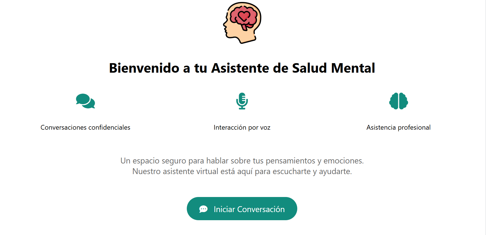
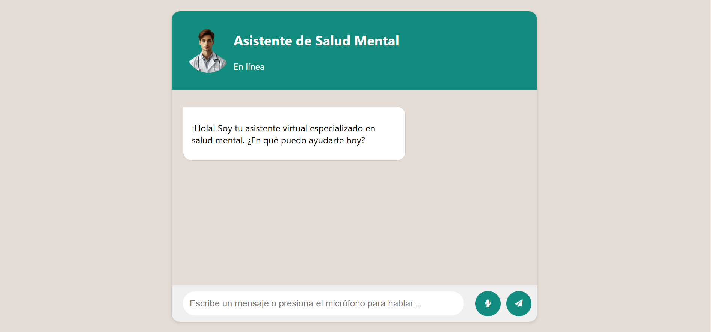
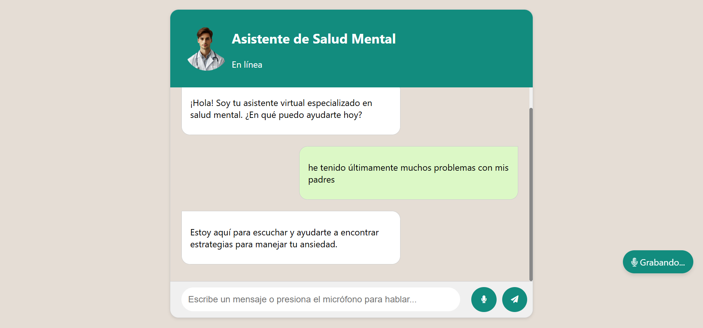

# Chatbot de Salud Mental - Versión 1.0

<div align="center">
  
  <br>
  <em>Logo del Chatbot de Salud Mental</em>
</div>

## Descripción del Proyecto

**(versión GitHub original)**  
Este proyecto es un chatbot **orientado a la salud mental** que, mediante **Procesamiento de Lenguaje Natural (PLN)**, analizaba los mensajes ingresados por los usuarios (ya fuera por **texto** o **audio**) para predecir su estado emocional y generar respuestas de apoyo.  
- **Interacción por voz (server-side)**: El usuario podía hablar, y el servidor generaba un archivo de audio de respuesta usando `pyttsx3`.  
- **Versión 1.0**: Implementación básica con 11 emociones, experimental y **no** sustituye asesoramiento profesional.

**(versión Hugging Face Spaces)**  
Actualmente, el chatbot sigue orientado a la salud mental, pero la **conversión de voz** (tanto STT como TTS) se hace **en el navegador** (usando Web Speech API). El servidor solo maneja texto (Flask + BERT).  
- **Interacción por voz (client-side)**: El usuario habla y el navegador (JavaScript) convierte el audio a texto; el servidor responde en texto, y el navegador usa Speech Synthesis para “hablar” la respuesta.  
- **No** se generan archivos de audio en el servidor ni se instalan librerías TTS (pyttsx3) o STT (PyAudio).

## Tecnologías Utilizadas
- **Python**: Flask (backend web), Transformers, PyTorch  
- **BERT** (Bidirectional Encoder Representations from Transformers)  
- **Procesamiento de Lenguaje Natural (PLN)**  
- **Reconocimiento de Voz** (SpeechRecognition en el navegador)  
- **Reconocimiento de Voz** y Síntesis de Voz en el Navegador** (Web Speech API)  
- **Síntesis de Texto a Voz** (pyttsx3/pydub)  
- **HTML, CSS, JavaScript** (Frontend)

## Arquitectura del Chatbot

El pipeline principal que sigue este proyecto es:

```text
 -> Speech Recognition -> Natural Language Understanding -> Dialog Manager <-> Task Manager
    Text-to-Speech Synthesis <- Natural Language Generation <- Dialog Manager
```

1. **Speech Recognition**: El usuario habla y el navegador convierte el audio a texto (Web Speech API).  
2. **Natural Language Understanding**: El texto se envía a Flask, donde BERT analiza la emoción.  
3. **Dialog Manager**: Gestiona la lógica de la conversación y decide la respuesta.  
4. **Text-to-Speech Synthesis**: El chatbot genera un archivo de audio que se devuelve al navegador.  

## Emociones Detectadas
El modelo (fine-tuned en BERT) reconoce las siguientes emociones:

- FELICIDAD
- NEUTRAL
- DEPRESIÓN
- ANSIEDAD
- ESTRÉS
- EMERGENCIA
- CONFUSIÓN
- IRA
- MIEDO
- SORPRESA
- DISGUSTO

Se utilizó un dataset de ~500 muestras para cada emoción (total ~5500 filas).

# Capturas de Pantalla

**Página de Inicio**
<div align="center">  <br> <em>Página de inicio del Chatbot de Salud Mental</em> </div>

**Interfaz del Chatbot**
<div align="center">  <br> <em>Interfaz del Chatbot</em> </div>

**Reconocimiento de Voz Activado**
<div align="center">  <br> <em>Indicador de grabación de voz</em> </div>

## Estructura del Proyecto

```text
ChatBot/
├── conversations/
├── data/
│   └── emotion_dataset.csv
├── models/
│   ├── bert_emotion_model/
│   │   ├── checkpoint-1600
│   │   ├── checkpoint-1650
│   │   ├── config.json
│   │   ├── model.safetensors
│   │   ├── special_tokens_map.json
│   │   ├── tokenizer.json
│   │   ├── tokenizer_config.json
│   │   ├── training_args.bin
│   │   └── vocab.txt
│   ├── chatbot_model.py
│   └── responses.json
├── static/
│   ├── audio/
│   ├── css/
│   │   └── styles.css
│   ├── img/
│   └── js/
│       └── scripts.js
├── templates/
│   ├── chatbot.html
│   └── index.html
├── app.py
├── chatbot.log
├── error.log
├── requirements.txt
└── train_model.py
```

## Instalación y Configuración

### 1. Clonar el repositorio con Git LFS
Si el proyecto usa archivos grandes (como modelos BERT), asegúrate de tener Git LFS instalado antes de clonar el repositorio.
```bash
# Instalar Git LFS (si no lo tienes)
git lfs install

# Clonar el repositorio
git clone https://github.com/tu-usuario/ChatBot-MentalHealth.git
cd ChatBot-MentalHealth
```

### 2. Crear un entorno virtual y activarlo
```bash
python -m venv venv
# En Windows
venv\Scripts\activate
# En macOS/Linux
source venv/bin/activate
```

### 3. Instalar dependencias
```bash
pip install -r requirements.txt
```

### 4. Ejecutar la aplicación
```bash
python app.py
```
La aplicación se ejecutará en [http://127.0.0.1:5000/](http://127.0.0.1:5000/).

## Ejemplo de Código (`train_model.py`)

```python
class CustomTrainer(Trainer):
    def compute_loss(self, model, inputs, return_outputs=False, **kwargs):
        labels = inputs.get("labels").to(model.device)
        outputs = model(**inputs)
        logits = outputs.get("logits")
        loss = custom_loss(labels, logits)  # Pérdida con class_weights
        return (loss, outputs) if return_outputs else loss

def custom_loss(labels, logits):
    loss_fct = torch.nn.CrossEntropyLoss(weight=class_weights)
    return loss_fct(logits, labels)
```

De esta forma, cada emoción recibe un peso distinto, mitigando el riesgo de que el modelo ignore las clases menos representadas.

## Flujo de Uso de los Archivos en el Proyecto

1. **Cargar el Modelo**: Los pesos del modelo están en `model.safetensors` junto con `config.json`, `tokenizer.json`, etc.
2. **Tokenización**: Se convierte la entrada (texto) en tokens con el tokenizer de BERT (`tokenizer.json`, `vocab.txt`).
3. **Inferencia**: El texto del usuario se procesa con BERT para predecir la emoción y generar una respuesta.
4. **Respuesta**: Se envía el texto de vuelta al navegador y, si se activa la síntesis de voz, se genera un archivo de audio.

## Notas Finales

- Esta versión (1.0) es experimental y **no** sustituye asesoramiento profesional en salud mental.
- Se recomienda seguir refinando el modelo, incorporar más emociones y ampliar la base de datos.
- En caso de emergencia o situación de riesgo, busca ayuda de un profesional de la salud mental.
- Destacamos la **diferencia** entre la versión original (generaba `.mp3` en el servidor con `pyttsx3`) y la **actual** (Web Speech API en el **navegador**).  
- Dejamos clara la **arquitectura** y las **tecnologías** usadas.  
- Resaltamos que ya no se requiere instalar librerías TTS en el contenedor Docker, pues todo se hace en el **cliente**.  

## Colaboradores
- **Nicolás Ceballos Brito** (@Nico2603) https://github.com/Nico2603
- **Juan Alejandro Urueña Serna** (@Uruena2603) https://github.com/Uruena2603
- **Camilo Castañeda Yepes** (@camCy) https://github.com/camCy

Para cualquier duda o sugerencia, contáctame en: **nicolasceballosbrito@gmail.com**

---

¡Gracias por probar el Chatbot de Salud Mental!  
Si deseas contribuir, siéntete libre de hacer un **fork** y enviar tus **pull requests**.
